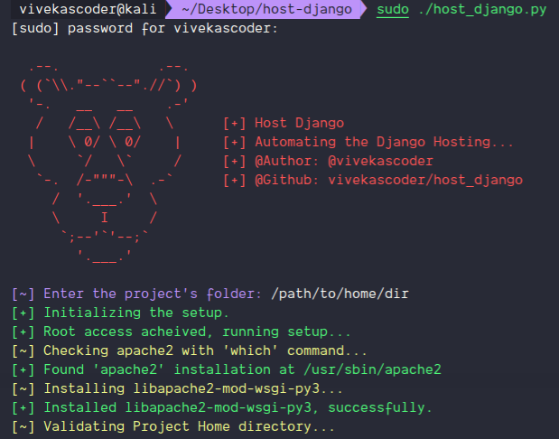

# host-django || TESTING, Bugs can be there...
- A script to automate the django hosting process with apache2 and mod_wsgi.
- Author: [@vivekascoder](https://instagram.com/vivekascoder/)

----

----

## How to use.
- Download the `host_django.py` file.
- Prerequisite:
  - Migrate the project and collectstatic.
  - Create a virtual enviroment with name `env` in the home directory.
  - Copy the path of project root directory.
- Run `sudo ./host_django.py` command and provide hostname and paste the project root.
- You're all set now.

## In case it didn't work.
- You can contribute or report the bug at [vivekascoder](mailto:vivekascoder@gmail.com).